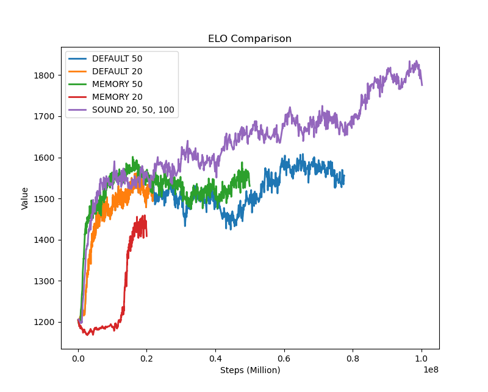
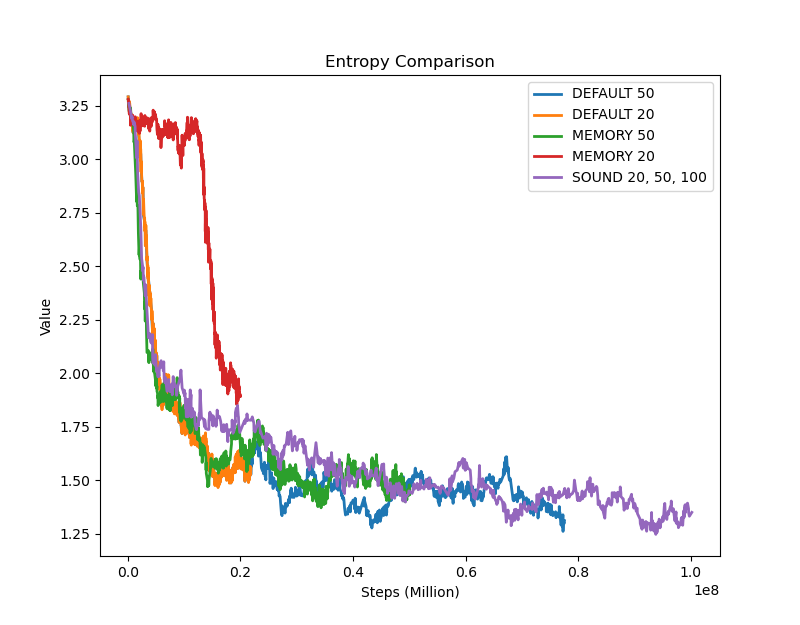
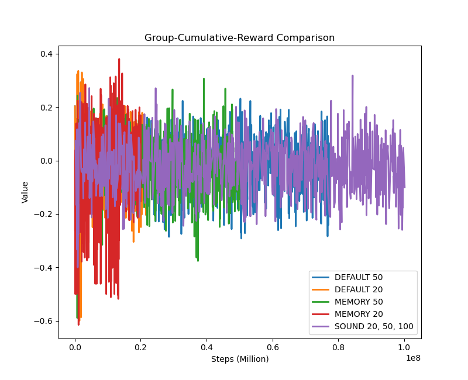
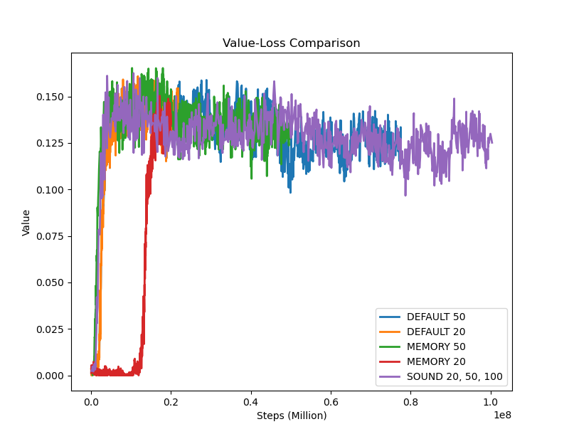

# ML Model Performance Analysis

## Overview

This analysis compares different Memory Sensor trainign steps against different Base Case training steps.

## Configurations

- Base Case (20 million steps)
- Base Case (50 million steps)
- Memory Sensor (50 million steps)
- Memory Sensor (20 million setps)

## Metrics Analysis

### ELO Rating

| Configuration         | Mean    | Std Dev | Min     | Max     |
| --------------------- | ------- | ------- | ------- | ------- |
| Base Case             | 1506.60 | 66.53   | 1199.95 | 1608.24 |
| Base Case 20          | 1459.93 | 92.54   | 1199.95 | 1561.27 |
| Memory Sensor 50      | 1522.45 | 53.22   | 1194.28 | 1601.35 |
| Memory Sensor 20      | 1280.55 | 109.63  | 1167.39 | 1459.09 |

### Entropy

| Configuration         | Mean | Std Dev | Min  | Max  |
| --------------------- | ---- | ------- | ---- | ---- |
| Base Case 50          | 1.57 | 0.34    | 1.26 | 3.29 |
| Base Case 20          | 1.92 | 0.51    | 1.47 | 3.29 |
| Memory Sensor 50      | 1.68 | 0.31    | 1.37 | 3.28 |
| Memory Sensor 20      | 2.81 | 0.49    | 1.85 | 3.28 |

### Group Cumulative Reward

| Configuration         | Mean   | Std Dev | Min    | Max   |
| --------------------- | ------ | ------- | ------ | ----- |
| Base Case 50          | -0.019 | 0.098   | -0.359 | 0.293 |
| Base Case 20          | -0.020 | 0.109   | -0.600 | 0.335 |
| Memory Sensor 50      | -0.026 | 0.095   | -0.590 | 0.307 |
| Memory Sensor 20      | -0.036 | 0.137   | -0.615 | 0.380 |

### Policy Loss

| Configuration         | Mean  | Std Dev | Min   | Max   |
| --------------------- | ----- | ------- | ----- | ----- |
| Base Case 50            | 0.017 | 0.002   | 0.010 | 0.027 |
| Base Case 20          | 0.017 | 0.002   | 0.010 | 0.026 |
| Memory Sensor 50      | 0.017 | 0.002   | 0.011 | 0.028  |
| Memory Sensor 20      | 0.017 | 0.002   | 0.011 | 0.026 |

### Value Loss

| Configuration         | Mean  | Std Dev | Min   | Max   |
| --------------------- | ----- | ------- | ----- | ----- |
| Base Case 50          | 0.130 | 0.026   | 0.000 | 0.160 |
| Base Case 20          | 0.123 | 0.043   | 0.000 | 0.161 |
| Memory Sensor 50      | 0.134 | 0.022   | 0.000 | 0.165 |
| Memory Sensor 20      | 0.044 | 0.058   | 0.000 | 0.150 |

## Key Observations

1. #### Goals Scored
Fixed Delta Time: 0.01

| Sensor Type   | Goals Scored  | Sensor Type      | Goals Scored   | Total Goals   | Ratio   | 
| ------------- | ------------- | ---------------- | -------------- | ------------- | ------- |
| Base Case 50  | 111967        | Memory Based 50  | 105574         | 217541        | 1.06055 |
| Base Case 20  | 12004         | Memory Based 20  | 8272           | 20276         | 1.45116 |

- Description:
This metric evaluates the total number of goals scored by agents using different sensor configurations during a fixed delta time of 0.01. The goal is to understand whether memory-equipped agents perform better in terms of scoring when compared to the base case.
- Evaluation:
    - For the 50 million steps configuration:
        - The Memory-Based Sensor scored 105,574 goals, while the Base Case scored 111,967 goals.
        - Combined, they scored 217,541 goals, yielding a ratio of 1.06055, suggesting collaborative scoring was marginally improved by the Memory Sensor.
    - For the 20 million steps configuration:
        - The Memory-Based Sensor scored 8,272 goals, compared to the Base Case’s 12,004 goals.
        - The combined score was 20,276 goals, with a significantly higher ratio of 1.45116, highlighting that memory-equipped agents contributed proportionally more in this shorter training duration.

2. ELO
- Description:
ELO measures the relative competitive performance of agents. A higher ELO indicates better decision-making, strategic planning, and overall game outcomes.
- Evaluation:
    - The Memory Sensor (50 million steps) achieved the highest mean ELO (1522.45), outperforming both the Base Case (50 million steps) (1506.60) and the Base Case (20 million steps) (1459.93).
    - However, the Memory Sensor (20 million steps) had the lowest mean ELO (1280.55), likely due to insufficient training leading to less refined strategies.
    - The lower standard deviation for the Memory Sensor (50 million steps) (53.22) reflects more consistent performance compared to the Memory Sensor (20 million steps) (109.63).

3. Entropy
- Description:
Entropy reflects the diversity in actions taken by agents. Higher entropy suggests broader exploration, which can be beneficial during training but may hinder stable policy convergence.
- Evaluation:
    - The Memory Sensor (50 million steps) had an entropy of 1.68, slightly higher than the Base Case (50 million steps) (1.57), indicating slightly increased exploration.
    - The Memory Sensor (20 million steps) had significantly higher entropy (2.81) compared to the Base Case (20 million steps) (1.92), suggesting excessive exploration and less stable decision-making.

4. Group Cumulative Rewards
- Description:
This metric represents the total rewards accumulated by agents during training. Near-zero values suggest balanced matches, while deviations indicate challenges or inefficiencies in performance.
- Evaluation:
    - The Memory Sensor (50 million steps) recorded a mean cumulative reward of -0.026, slightly lower than the Base Case (50 million steps) (-0.019).
    - The Memory Sensor (20 million steps) scored -0.036, which was also lower than the Base Case (20 million steps) (-0.020), reflecting difficulties in reward optimization during shorter training.

5. Policy Loss
- Description:
Policy loss measures the magnitude of updates made to an agent’s policy. A lower value suggests more stable and effective learning.
- Evaluation:
    - All configurations exhibited comparable policy loss (0.017), indicating stable training across setups.
    - The addition of memory did not introduce instability, as both the Memory Sensors (20 and 50 million steps) had policy loss values consistent with their respective Base Cases.

6. Value Loss
- Description:
Value loss quantifies the accuracy of predicting future rewards. Lower value loss indicates better predictive capabilities and more effective learning.
- Evaluation:
    - The Memory Sensor (50 million steps) recorded a slightly higher value loss (0.134) than the Base Case (50 million steps) (0.130), reflecting the additional complexity introduced by memory integration.
    - The Memory Sensor (20 million steps) had a significantly lower value loss (0.044) compared to the Base Case (20 million steps) (0.123). However, this may indicate oversimplified strategies, as seen in the lower ELO and cumulative rewards for this configuration.