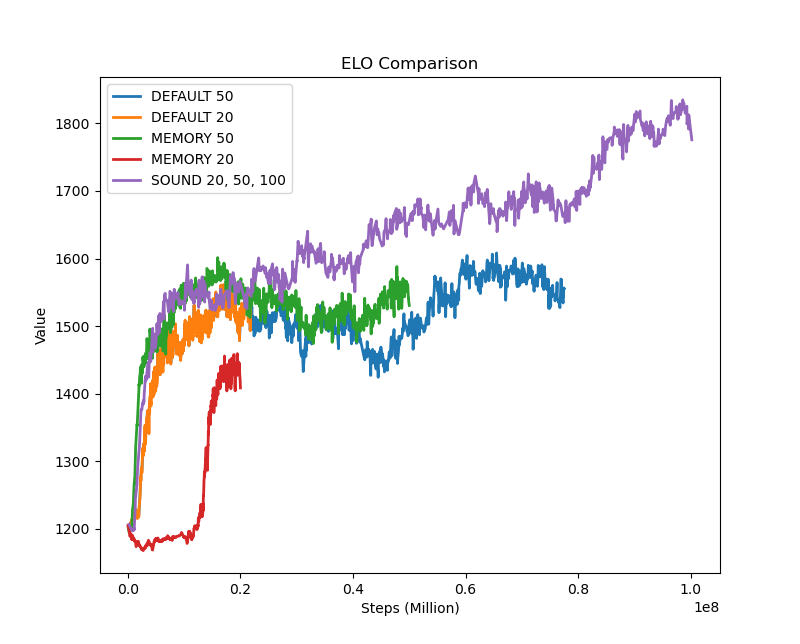
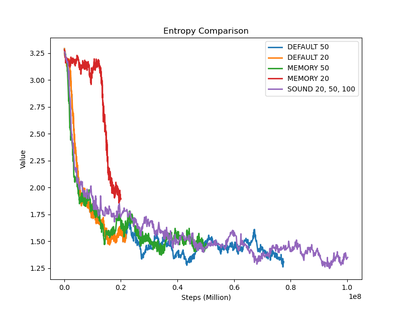
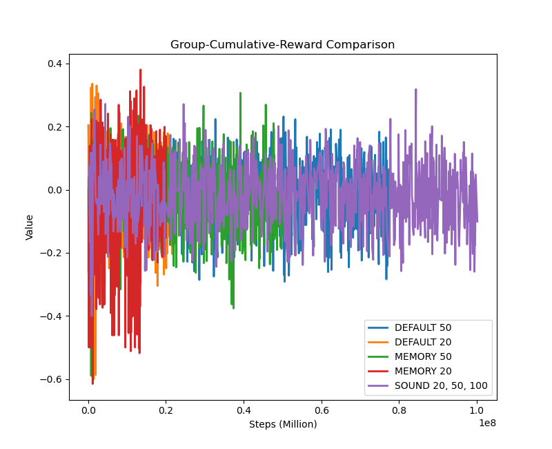
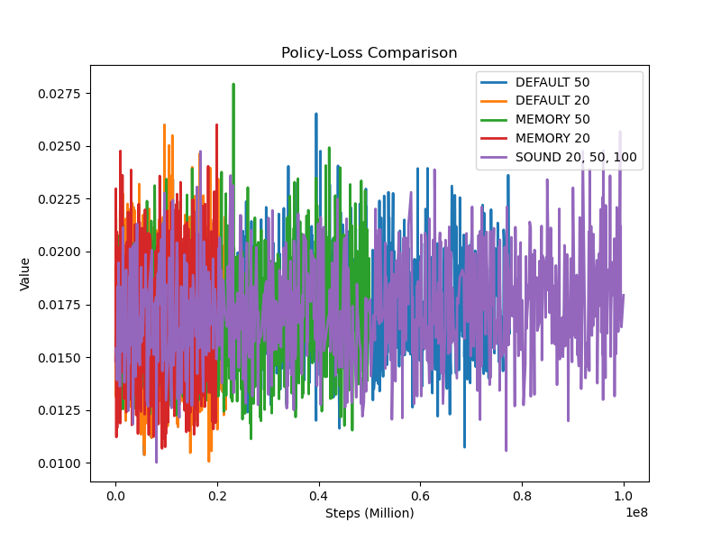

# ML Model Performance Analysis

## Overview

This analysis compares different Memory Sensor trainign steps against different Base Case training steps.

## Configurations

- Base Case (20 million steps)
- Base Case (50 million steps)
- Base Case (100 million steps)
- Sound Sensor (100 million steps)
- Sound Sensor (50 million steps)
- Sound Sensor (20 million setps)

## Metrics Analysis

### ELO Rating

| Configuration         | Mean    | Std Dev | Min     | Max     |
| --------------------- | ------- | ------- | ------- | ------- |
| Base Case             | 1506.60 | 66.53   | 1199.95 | 1608.24 |
| Base Case 20          | 1459.93 | 92.54   | 1199.95 | 1561.27 |
| Memory Sensor 50      | 1522.45 | 53.22   | 1194.28 | 1601.35 |
| Memory Sensor 20      | 1280.55 | 109.63  | 1167.39 | 1459.09 |

### Entropy

| Configuration         | Mean | Std Dev | Min  | Max  |
| --------------------- | ---- | ------- | ---- | ---- |
| Base Case 50          | 1.57 | 0.34    | 1.26 | 3.29 |
| Base Case 20          | 1.92 | 0.51    | 1.47 | 3.29 |
| Memory Sensor 50      | 1.68 | 0.31    | 1.37 | 3.28 |
| Memory Sensor 20      | 2.81 | 0.49    | 1.85 | 3.28 |

### Group Cumulative Reward

| Configuration         | Mean   | Std Dev | Min    | Max   |
| --------------------- | ------ | ------- | ------ | ----- |
| Base Case 50          | -0.019 | 0.098   | -0.359 | 0.293 |
| Base Case 20          | -0.020 | 0.109   | -0.600 | 0.335 |
| Memory Sensor 50      | -0.026 | 0.095   | -0.590 | 0.307 |
| Memory Sensor 20      | -0.036 | 0.137   | -0.615 | 0.380 |

### Policy Loss

| Configuration         | Mean  | Std Dev | Min   | Max   |
| --------------------- | ----- | ------- | ----- | ----- |
| Base Case 50            | 0.017 | 0.002   | 0.010 | 0.027 |
| Base Case 20          | 0.017 | 0.002   | 0.010 | 0.026 |
| Memory Sensor 50      | 0.017 | 0.002   | 0.011 | 0.028  |
| Memory Sensor 20      | 0.017 | 0.002   | 0.011 | 0.026 |

### Value Loss

| Configuration         | Mean  | Std Dev | Min   | Max   |
| --------------------- | ----- | ------- | ----- | ----- |
| Base Case 50          | 0.130 | 0.026   | 0.000 | 0.160 |
| Base Case 20          | 0.123 | 0.043   | 0.000 | 0.161 |
| Sound Sensor 100      | x | 0.022   | 0.000 | 0.165 |
| Sound Sensor 50       | 0.134 | 0.022   | 0.000 | 0.165 |
| Sound Sensor 20       | 0.044 | 0.058   | 0.000 | 0.150 |

## Key Observations

1. #### Goals Scored
Fixed Delta Time: 0.01

| Sensor Type   | Goals Scored  | Sensor Type      | Goals Scored   | Total Goals   | Ratio   | 
| ------------- | ------------- | ---------------- | -------------- | ------------- | ------- |
| Base Case 100 | x        | Memory Based 100 | x         | x        | x |
| Base Case 50  | x        | Memory Based 50  | x         | x        | x |
| Base Case 20  | x         | Memory Based 20  | x           | x         | x |

- Description:
- Evaluation:

2. ELO
- Description:
- Evaluation:

3. Entropy
- Description:
- Evaluation:

4. Group Cumulative Rewards
- Description:
- Evaluation:

5. Policy Loss
- Description:
- Evaluation:

6. Value Loss
- Description:
- Evaluation: