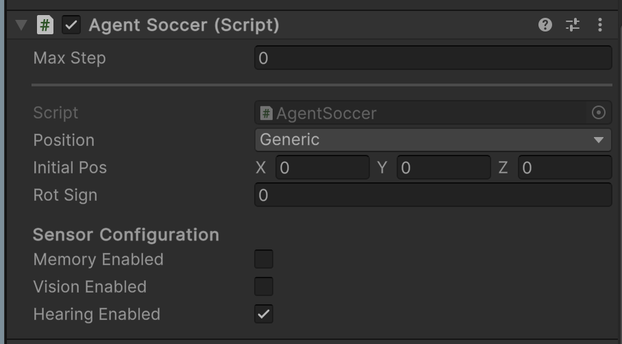

# AIML-8: Experimental Workflow Documentation

## Guidelines for Running Experiments

### Experiment 1 - Different Hyperparameters

#### Step 1: Switch to the `experiment-1` Branch

Ensure that you are working within the correct branch of the repository. Switch to the `experiment-1` branch before proceeding.

---

#### Step 2: Activate the Conda Environment

Activate the designated Conda environment using the Anaconda Prompt.

**Command:**

```bash
conda activate [mlagents_env_name]
```

**Example**:

```bash
conda activate mlagents
```

---

#### Step 3: Navigate to the Project Root Directory

Change the current working directory to the root of the project.

**Command:**

```bash
cd [Root Project]
```

**Example**:

```bash
cd C:\Users\pc\Documents\GitHub\Project2-1-AIML8
```

---

#### Step 4: Execute the Training Command with the Desired Configuration

Run the training process using the `mlagents-learn` command along with the appropriate configuration file.

**Command:**

```bash
mlagents-learn config/poca/[Config File Name].yaml --run-id=[run_name]
```

**Example for running Reduced Batch Size**:

```bash
mlagents-learn config/poca/SoccerTwos_Reduced_Batch_Size.yaml --run-id=Reduced_batch_size
```

---

#### Step 5: View TensorBoard Graphs

Run the TensorBoard command to view the graphs in real-time while training.

**Command:**

```bash
tensorboard --logdir results --port 6006
```

- Open it the [browser](http://localhost:6006)

---

By following these steps, you can ensure the proper execution of Experiment 1 within the `AIML-8 project`. Make sure to customize the configuration file and run name as needed for specific configurations.

### Experiment 2 - Different Sensors

#### Step 1: Switch to the `experiment-2` Branch

Ensure that you are working within the correct branch of the repository. Switch to the `experiment-2` branch before proceeding.

---

### Default Setup: Memory Sensor (50M Steps) vs Sound Sensor (50M Steps)

The branch is pre-configured with a default setup. Follow the steps below to run other cases or hit the play button to run the default case.

---

## How to run other cases

### Apply the Following Configuration Steps to All Agents in the Scene:

#### Step 1: Open the Default `SoccerFieldTwos` Scene

Navigate to and open the default `SoccerFieldTwos` scene within the Unity Editor.

---

#### Step 2: Access the `BehaviourParameters` Component

Locate the `BehaviourParameters` component for the desired agent.

---

#### Step 3: Select the Desired Model

Choose the appropriate model from the available options:

**Available Models:**

- `Default_20_SoccerTwos`
- `Default_50_SoccerTwos`
- `Default_100_SoccerTwos`
- `Memory_20_SoccerTwos`
- `Memory_50_SoccerTwos`
- `Sound_20_SoccerTwos`
- `Sound_50_SoccerTwos`
- `Sound_100_SoccerTwos`


---

#### Step 4: Modify the `AgentSoccer` Script Component

Access the `AgentSoccer` script component for the agent.

---

#### Step 5: Choose the Appropriate Sensor Configuration

Within the `AgentSoccer` script, select the desired sensor configuration.

**Reference Image:**



---
