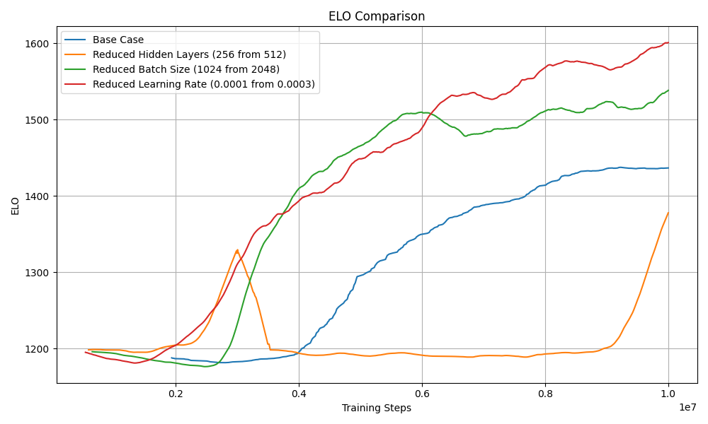
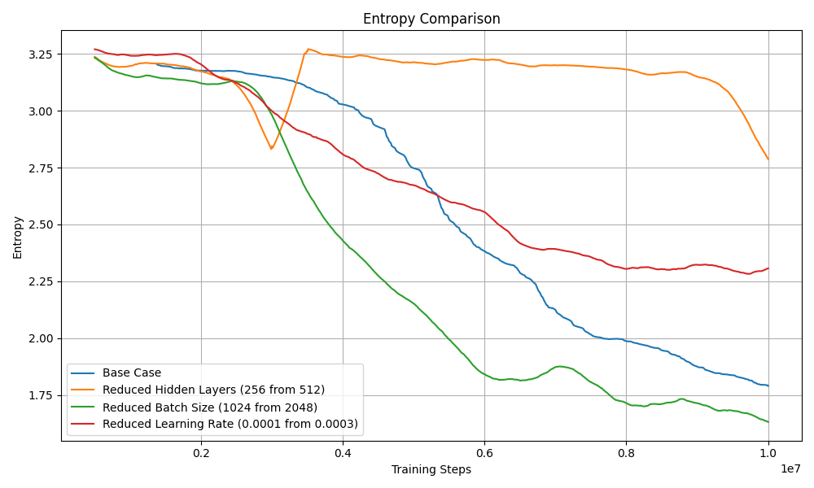
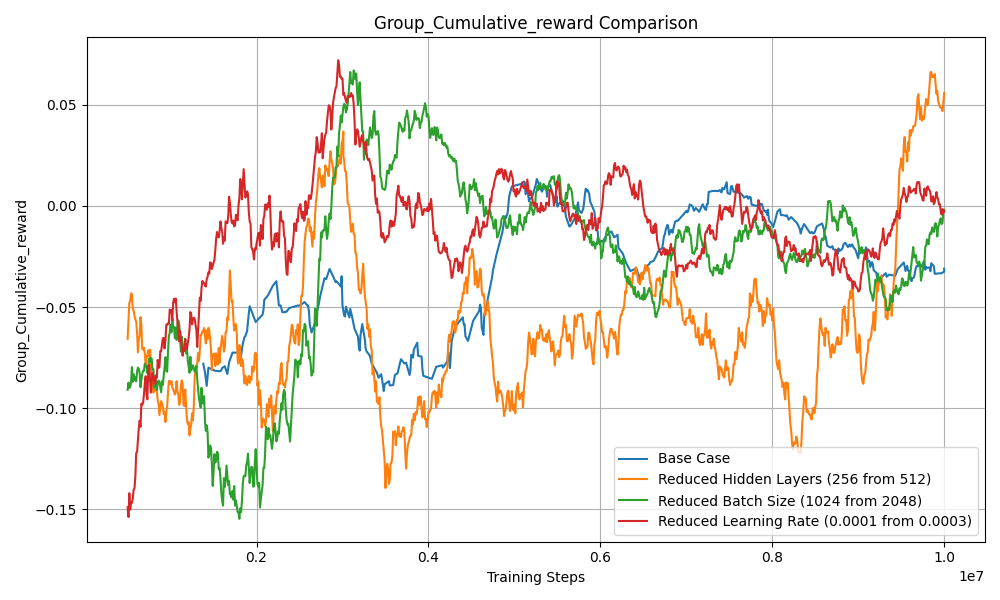
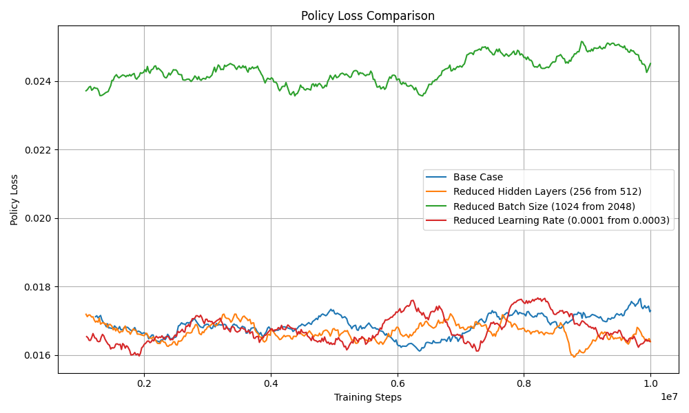
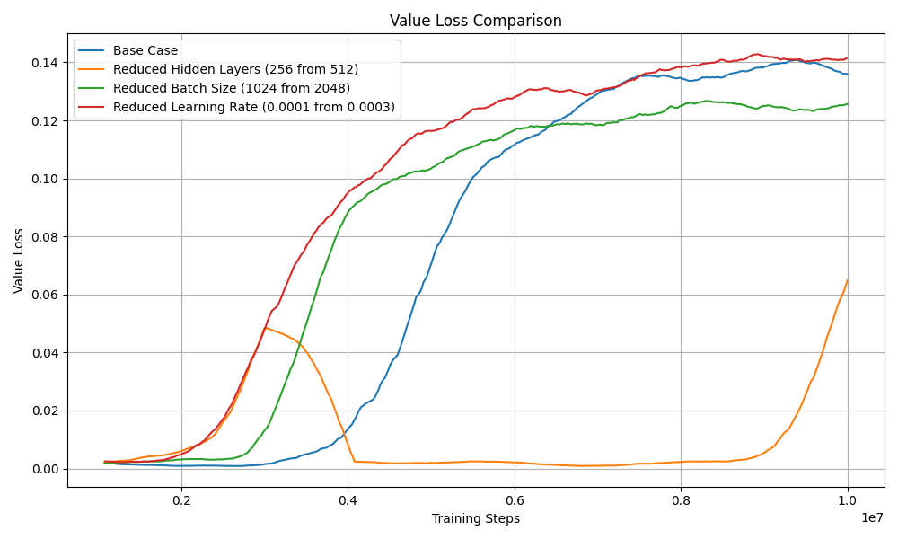

# ML Model Performance Analysis

## Overview

This analysis compares different model configurations against the base case, examining key metrics across various hyperparameter adjustments (without any additional sensors).

## Configuration Variants

- Base Case (Default)
- Reduced Hidden Layers (256 from 512)
- Reduced Batch Size (1024 from 2048)
- Reduced Learning Rate (0.0001 from 0.0003)

## Metrics Analysis

### ELO Rating

| Configuration         | Mean    | Std Dev | Min     | Max     |
| --------------------- | ------- | ------- | ------- | ------- |
| Base Case             | 1436.58 | 8.44    | 1415.52 | 1455.29 |
| Reduced Hidden Layers | 1319.51 | 65.77   | 1204.45 | 1417.78 |
| Reduced Batch Size    | 1526.17 | 16.95   | 1493.37 | 1567.29 |
| Reduced Learning Rate | 1590.64 | 14.66   | 1557.76 | 1628.17 |

### Entropy

| Configuration         | Mean | Std Dev | Min  | Max  |
| --------------------- | ---- | ------- | ---- | ---- |
| Base Case             | 1.79 | 0.04    | 1.70 | 1.89 |
| Reduced Hidden Layers | 2.92 | 0.16    | 2.64 | 3.15 |
| Reduced Batch Size    | 1.66 | 0.03    | 1.58 | 1.73 |
| Reduced Learning Rate | 2.30 | 0.03    | 2.22 | 2.37 |

### Group Cumulative Reward

| Configuration         | Mean   | Std Dev | Min    | Max   |
| --------------------- | ------ | ------- | ------ | ----- |
| Base Case             | -0.028 | 0.072   | -0.179 | 0.135 |
| Reduced Hidden Layers | 0.037  | 0.154   | -0.340 | 0.365 |
| Reduced Batch Size    | -0.022 | 0.094   | -0.307 | 0.220 |
| Reduced Learning Rate | -0.001 | 0.094   | -0.202 | 0.241 |

### Policy Loss

| Configuration         | Mean  | Std Dev | Min   | Max   |
| --------------------- | ----- | ------- | ----- | ----- |
| Base Case             | 0.017 | 0.003   | 0.011 | 0.023 |
| Reduced Hidden Layers | 0.016 | 0.002   | 0.011 | 0.021 |
| Reduced Batch Size    | 0.025 | 0.002   | 0.021 | 0.029 |
| Reduced Learning Rate | 0.016 | 0.002   | 0.010 | 0.021 |

### Value Loss

| Configuration         | Mean  | Std Dev | Min   | Max   |
| --------------------- | ----- | ------- | ----- | ----- |
| Base Case             | 0.136 | 0.007   | 0.123 | 0.151 |
| Reduced Hidden Layers | 0.066 | 0.027   | 0.017 | 0.112 |
| Reduced Batch Size    | 0.126 | 0.006   | 0.116 | 0.142 |
| Reduced Learning Rate | 0.142 | 0.007   | 0.123 | 0.153 |

## Key Observations

1. #### The Reduced Learning Rate configuration achieved the highest ELO rating (mean: 1590.64)
   - A high ELO rating in self-play environments indicates better performance in competitive tasks. The reduced learning rate allowed the agent to make smaller, more stable updates to the policy, which likely resulted in improved convergence and better fine-tuning.
   - **Evaluation**: This is a positive outcome because it suggests that a smaller learning rate helps the agent avoid overshooting optimal policy updates and instead gradually improves over time. However, this might come at the cost of slower initial learning, which should be weighed against the training duration.
2. #### Reduced Hidden Layers showed the highest entropy and variance in performance
   - High entropy indicates that the agent is exploring a wider range of actions. This can be beneficial early in training but undesirable in later stages if the agent struggles to exploit its learned policy.
   - **Evaluation**: The high entropy and variance suggest that reducing hidden layers (from 512 to 256) limited the model's capacity, causing it to struggle to find a stable policy. While exploration is critical, excessive entropy in the final stages of training can indicate that the agent hasn't fully converged. This is likely a negative outcome as it implies the model architecture was too small to capture the complexity of the task.
3. #### Group Cumulative Rewards remained relatively close to zero across all configurations
   - Cumulative rewards close to zero may suggest that the task is inherently challenging, the agents are evenly matched (a common outcome in self-play scenarios), or the reward structure promotes balance.
   - **Evaluation**: This result is not necessarily positive or negative. In the context of self-play, a near-zero cumulative reward indicates that the agents are learning strategies that counterbalance each other effectively. However, the environment requires agents to achieve positive rewards (e.g., scoring goals in SoccerTwos), highlights a failure to learn effective behaviors across all configurations. This points to limitations in the policy, the sensor setup, or the hyperparameter configurations.
4. #### Policy Loss was fairly consistent across configurations, with slightly higher values for Reduced Batch Size
   - Policy loss measures how much the agent's policy is being updated. A higher policy loss for the Reduced Batch Size configuration may indicate noisier updates due to smaller batches.
   - **Evaluation**: This is a mixed outcome. The slightly higher policy loss suggests that the reduced batch size led to less stable gradient updates, which can harm training efficiency and convergence. Maintaining a balance between batch size and computational efficiency is crucial, and smaller batch sizes might not be ideal for this task.
5. #### Value Loss showed notable improvement in the Reduced Hidden Layers configuration
   - Value loss measures the accuracy of the value function, which is used to predict future rewards. Lower value loss indicates better predictions.
   - **Evaluation**: While lower value loss is generally a good sign, in this case, the improvement may stem from the reduced capacity of the network. The smaller network may have learned a simpler approximation of the value function that fits the limited task complexity but might struggle to generalize. This could explain why the agent showed higher entropy (struggling to exploit learned behaviors). Overall, this suggests a trade-off where the reduced architecture simplifies value estimation but potentially limits policy performance.
